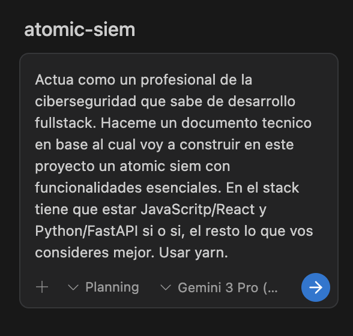
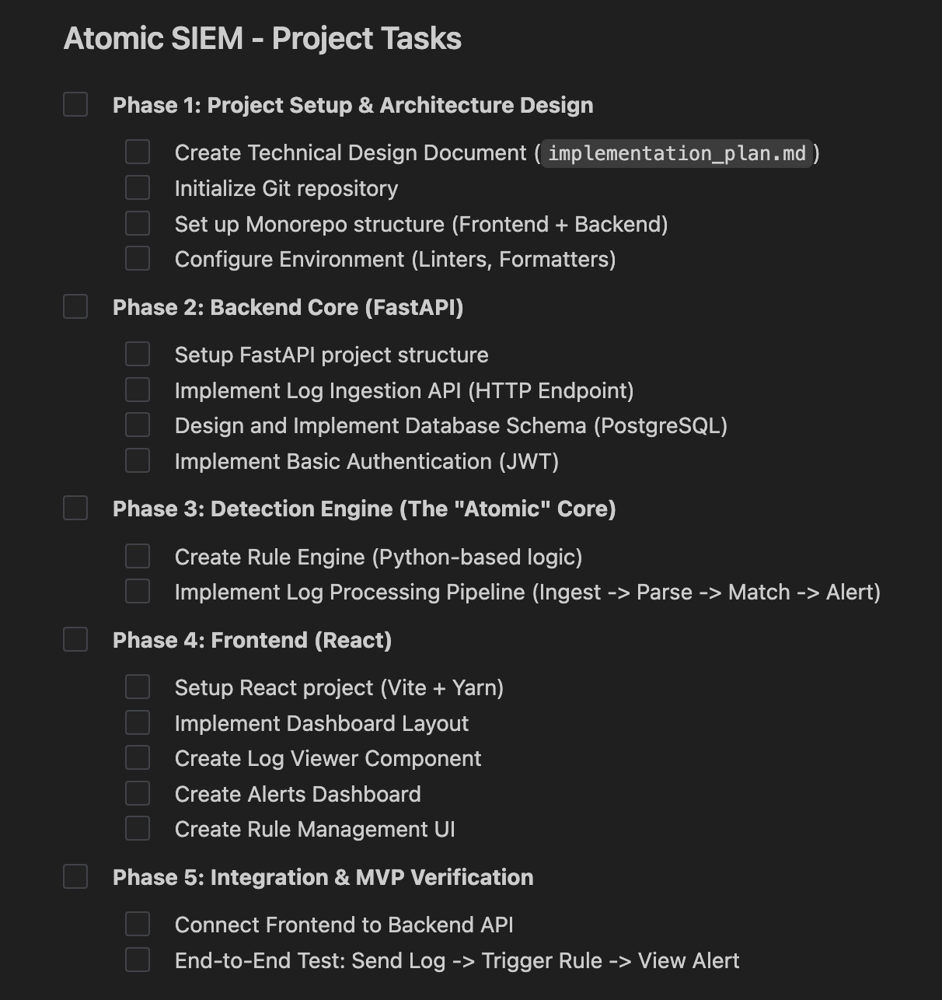

# Building Atomic SIEM with AI

This document chronicles the development journey of **Atomic SIEM**, a project built to demonstrate core cybersecurity concepts using modern full-stack technologies. The project is being developed with the assistance of an advanced AI agent to accelerate planning, boilerplate generation, and implementation while adhering to strict engineering standards.

## Phase 1: Inception & Planning

The project kicked off with a clear goal: build a lightweight SIEM with essential functionalities (Log Ingestion, Detection, Alerting) using a specific stack (React, Python/FastAPI).

### Initial Prompt
We defined the scope and constraints, ensuring a focus on "Atomic" (essential) features.

### Task Breakdown
The AI proposed a structured implementation plan, breaking the project into logical phases:
1.  **Setup & Architecture**: Monorepo structure, tooling.
2.  **Backend Core**: FastAPI, Database, Auth.
3.  **Detection Engine**: The core logic.
4.  **Frontend**: React dashboard.
5.  **Integration**: End-to-end testing.

---
*This document will be updated as the project evolves.*
